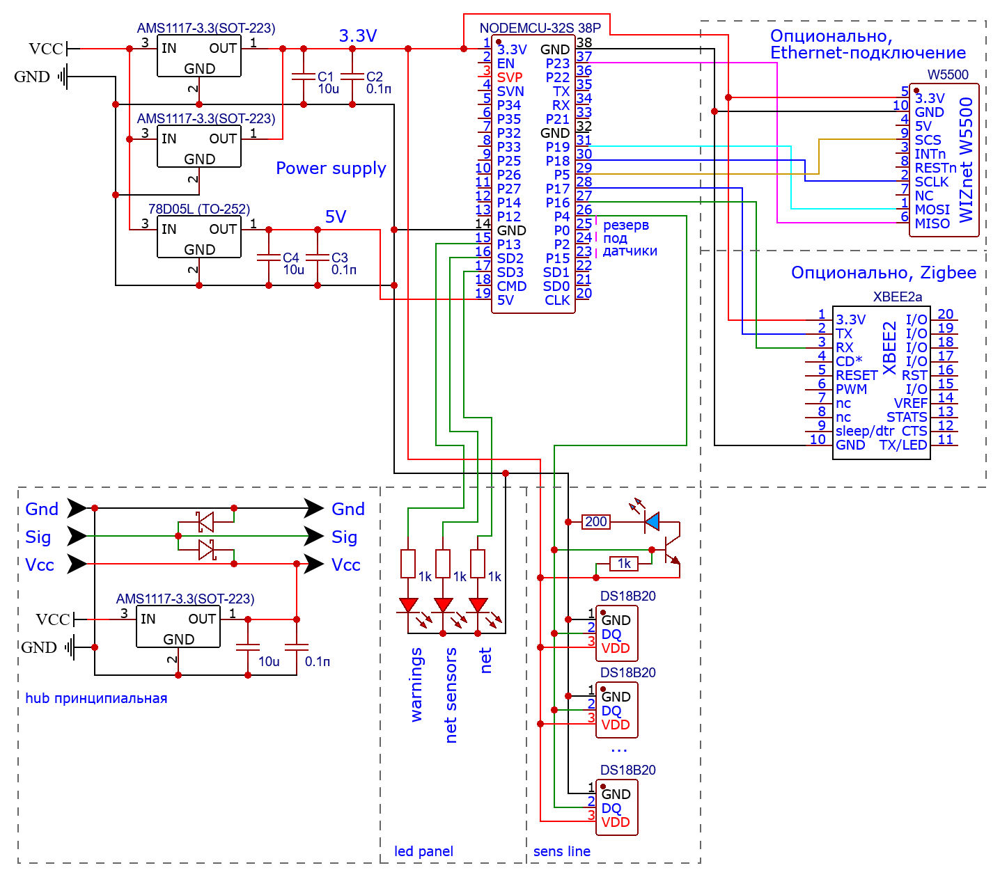

# ТЗ по проекту
## Общие сведения

1. Цель проекта  
Разработать устройство мониторинга климата для серверных помещений.   
2. Команда исполнителей
- Векшин Арсений P3316 
- Хасаншин Марат P3333

## Технические требования

1. Требования к функциональным характеристикам
- Устройство должно взаимодействовать со следующими типами датчиков:
  - ds18b20 (в различных вариациях) по протоколу 1-Wire в обоих вариациях питания (паразитный и классический)
  - Различные датчики доступные по протоколу Zigbee (опционально)
- Датчики должны иметь следущие атрибуты:
  - адрес (сеть/mac/id)
  - статус (работает / отключен / ошибка)
  - имя (до 20 симв)
  - значение температуры
  - минимальное значение триггера
  - максимальное значение триггера
  - время ошибки / срабатывания триггера 
- Должен производиться расчет контрольных разниц температур, со следущими атрибутами:
  - имя (до 20 симв)
  - id датчиков (2 шт)
  - минимальное значение триггера
  - максимальное значение триггера
  - время ошибки / срабатывания триггера

2. Требования к надежности
- Устройство должно корректно считавать данные со всех, корректно подключенных датчиков линии, независимо от неисправных датчиков, также подключеннных к этой линии.   
- Устройство должно корректно отрабатывать в случае некорректного подключения линии/датчика, отображая статус на сигнальной панели.
- Устройство должно быть защищено от внешних воздействий, способных нарушить его работу, иметь непроводящий корпус. 

3. Условия эксплуатации
- Предпологается эксплуатация в серверных помещениях, вне экстремальных условий.   
- Максимальный размер устройства: 200х200х100 мм.   
- Источник питания 5-20V, с мощностью не менее 5W.

4. Требования к составу и параметрам технических средств
- Комплект устройства включает:
  - основное устройство (ethernet, 4 разьема для датчиков, разьем питания, световая индикация)
  - промежуточный хаб (1 входной + 2 выходных разьема для датчиков, разьем питания)

5. Требования к информационной и программной совместимости
- Устройство должно быть доступно для общения через:
  - web-интерфейс
  - telnet \ ssh
  - snmp

## Требования к документации

- Файл README с описанием проекта, шагов запуска и зависимостей.
- Руководство пользователя с пошаговыми инструкциями.
- Техническое руководство по настройке и эксплуатации устройства.
## Технико-экономические показатели

Прототип:
| # | имя                            | кол-во | Цена/шт |
|---|--------------------------------|--------|---------|
| 1 | NodeMCU-32S 38P                | 1      | 757     |
| 2 | Wiznet W5500                   | 1      | 580     |
| 3 | xBee shield (v2?)              | 1??    | 4040    |
| 4 | ds18b20                        | 4      | 70      |
| 5 | Стабилизатор AMS1117-3.3       | 4      | 9       |
| 6 | Стабилизатор 78d05l            | 1      | 16      |
| 7 | Клемник винтовой DG308-2.54-03 | 8      | 26      |
| 8 | Расходники                     |        | 100     |
| - | Итоговая стоимость             |        | 6017    |

Изготовление печатной платы - 2$

Примерная стоимость серийного выпуска - 4500

## Cтадии и этапы разработки

1. **Анализ и проектирование системы** (2 недели):

  - Анализ и выбор оборудования.
  - Проектирование схемы устройства

2. **Разработка прототипа устройства** (4 + N недели):
  - Этап 1 (основной функционал):
    - Написание ПО, отладка схемы.
    - Создание тестового стенда с датчиками ds18b20
    - Отладка работы с датчиками температуры
  - Этап 2 (общение по сети):
    - Написание ПО, отладка схемы.
    - Отладка общения по сети
    - Отладка отображения сетевых датчиков
    - Отладка отображения в систему мониторинга
  - Этап 3 (опционально, ZigBee) - N недель
    - Написание ПО, отладка схемы.
    - Изучение протоколов общения с ZigBee-датчиками от Яндекс.
    - Отладка общения по протоколу ZigBee.

3. **Тестирование и отладка устройства** (2 недели):
  - Проверка работоспособности системы в различных условиях.

4. **Финальная приемка** (2 недели):
  - Разработка корпуса устройства
  - Подготовка документации и демонстрация работы системы.
## Порядок контроля и приемки

Демонстрационный образец должен отработать не менее недели без ошибок на тестовом стенде. Должны быть соблюдены вышеописанные требования к надежности, и содержанию.

## Компонентная база

| # | имя                            | кол-во | ссылка                                                                                        |
|---|--------------------------------|--------|-----------------------------------------------------------------------------------------------|
| 1 | NodeMCU-32S 38P                | 1      | [тык](https://roboshop.spb.ru/arduino/kontrollery-esp/nodemcu-32s-38pin-esp32)                |
| 2 | Wiznet W5500                   | 1      | [тык](https://roboshop.spb.ru/modules/interfejsy-i-perekhodniki/ethernet-moduli/w5500-module) |
| 3 | xBee shield (v2?)              | 1??    | [тык](https://amperka.ru/product/xbee)                                                        |
| 4 | ds18b20                        | 4      | [тык](https://roboshop.spb.ru/sensors/datchiki-temperatury-i-vlazhnosti/ds18b20 )             |
| 5 | Стабилизатор AMS1117-3.3       | 4      | [тык](https://www.chipdip.ru/product/ams1117-3.3-umw )                                        |
| 6 | Стабилизатор 78d05l            | 1      | [тык](https://www.chipdip.ru/product/78d05l)                                                  |
| 7 | Клемник винтовой DG308-2.54-03 | 8      | [тык](https://promelspb.ru/xcat/product/54684.html )                                          |
| - | Расходники                     |        |                                                                                               |
| 1 | Конденсатор керамический       | 4      |                                                                                               |
| 2 | Конденсатор электролитический  | 4      |                                                                                               |
| 3 | Резистор 1кОм + 100 Ом         | 10 + 5 |                                                                                               |
| 4 | Светодиоды 2кр, 2з, 4син       | 4      |                                                                                               |
| 5 | Кнопка тактовая  (высокая)     | 4      | [тык](https://roboshop.spb.ru/radio/knopki-pereklyuchateli-i-tumblery/kfc-a06-13h )           |
| 6 | Диод Шотки                     | 4      |                                                                                               |
| 7 | Гнездо 5.5 х 2.5 под пайку     | 2      | [тык](https://roboshop.spb.ru/radio/razieemy/razieemy-pitaniya/female-55x21)                  |
| 8 | Гнезда pbs-80                  | 2      |                                                                                               |
| 9 | Штыри pls-80                   | 2      |                                                                                               |

## Схема устройства
#### Принципиальная!!

На схеме представленны:
1. Контроллер `NodeMCU-32S 38P`, на базе контроллера `ESP32S`.
2. "Power supply" - преобразователи(подтяжка) питания
3. "sens line" - схема 1 линии датчиков протокола OneWire. Содержит в себе индикатор работы линии.
4. "hub" - схема хаба, подключаемого в разрыв линии датчиков протокола OneWire. Содержит в себе:
   - Стабилизатор питания с фильтром.
   - Защита от пульсаций по линии данных
5. "led panel" - индикационная панель, для отображения состояния системы
6. "Ethernet" - внешняя плата на базе W5500. Протокол SPI, по линии контроллера `SPI2`.
7. "ZigBee" - внешняя плата `XBee2`. Протокол UART, по линии контроллера `TX-RX-1`  
#### Примечание: все описанные модули подключены к выделенной линии питания(см. п2). Подключение к портам питания контроллера, без подтяжки, недопустимо.

## Архитектура ПО
Выделяются следующие модули:
1. sens - взаимодействие с датчиками. Зависимости:
    - OneWire.h
2. memory - сохранение в энергонезависимую память. Зависимости:
   - EEPROM.h
3. net - взаимодействие по сети. Зависимости:
    - SPI.h
    - Ethernet.h
    - EthernetUdp.h 
4. zigbee - взаимодействие по ZigBee. Зависимости:
    - xbee-arduino.h
#### Примечание: все упомянутые библиотеки являются стандартными библиотеками совместимого семейства контроллеров от AVR. 
